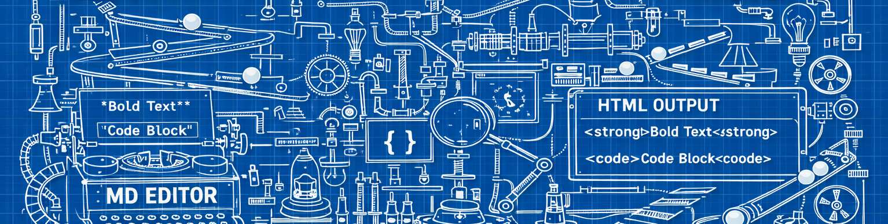

# Markdown 2 HTML


## Overview
   Markdown is deceptively simple until you try to parse it for real.
   Every edge case (nested lists, backticks, emphasis ambiguity, link titles)
   drags you toward a full grammar engine—something Markdown never had to begin with.
   This implementation takes a pragmatic, layered approach: a series of explicit,
   ordered passes that progressively rewrite a Markdown document into HTML,
   without using regexes or dynamic parser generators.

   The design accepts imperfection as a feature. It doesn’t aim for complete
   CommonMark compliance; instead, it focuses on consistency, predictability,
   and human readability of the output. The result is a parser that covers
   roughly 95% of everyday Markdown ( **bold**, *italic*, __underscore__, ~~strikethrough~~, [Links](https://google.com), headings, lists, etc) without any external dependencies, and
   whose internal logic is readable, hackable, and debuggable in a single file.

## Approach
   
   The idea came from this post where someone just applied a series of successive
   regex substitutions to minimaly convert Markdown to HTML.
   <https://dev.to/casualwriter/a-simple-markdown-parser-in-50-lines-of-js-4gpi>
   Turns out this is "good enough" for my purposes.

   The parser processes text in sequential phases, each making one kind of
   structural decision and passing the result forward. This mirrors how a
   human visually parses Markdown—recognizing code fences before thinking
   about paragraphs, for example.

### Phase 0 — Normalize newlines

 - Convert CRLF and CR into '\n'.  No further processing assumes Windows line endings.

### Phase 1 — Fence and code extraction

 - Splits the document into TEXT and CODE chunks based on ``` or ~~~ fences.
 - These are emitted verbatim later as <pre><code> blocks and skipped during
 - inline/structural parsing, isolating code content from further rewriting.

### Phase 2 — TEXT block rendering

- Each TEXT chunk is processed line by line.
- Detects headers (#..#####)
- Horizontal rules (---, ***, ___)
- Blockquotes (> and >>)
- Lists (unordered: -, +, *, ordered: 1. 2. ...)
- Indented code (4+ spaces or tabs)
- Paragraphs and soft line breaks
- Inline syntax: escapes, code spans, links, images, emphasis, deletion, insertion

### Phase 3 — Merge and emit
- Concatenates rendered TEXT and CODE chunks into final HTML.
- Adjacent fenced code blocks with the same type are coalesced for compactness.

## Implementation Notes
  
- Inline parsing uses literal scanning and balanced-marker search. No regex engine is used; everything is done with simple loops and pointer arithmetic.
- The order of inline rules matters: escapes → code spans → images/links → strong/emphasis → deletions/insertions → raw text. This ordering minimizes ambiguity between overlapping markers.
- Links and images use a strict "URL before title" rule.
The URL ends at the first whitespace leading to a quoted title, if present.
Escaped quotes inside titles (\"foo\") are supported.
- Autolinks ('<'http://...'>') are handled as a special case.
- Lists are parsed by indentation width and bullet markers, not by recursive descent.  This works for all "normal" Markdown, though pathological mixes of bullets and numbers at varying indents may behave differently than CommonMark.

## Limitations (and why that’s fine)
  
Markdown is not a real grammar. It’s a social contract with many dialects.
The philosophy here is “parse what’s obvious, escape what’s not.”
Anything inside backticks or fences is sacred. Everything else is fair game.

In short, it transforms the most useful and visually consistent subset of Markdown
into safe HTML without the usual chaos or regex nightmares.

````
  // We support code blocks
  *((int*)(0)) = "Ka-boom!";

```` 

> We also support quotation blocks

- We also support 
 - unordered
 - lists

1. Ordered lists
2. Are also supported, but a bit hacky at the moment...

## Final considerations

> **I hate parsing Markdown.**
> **F*37c Markdown.**
